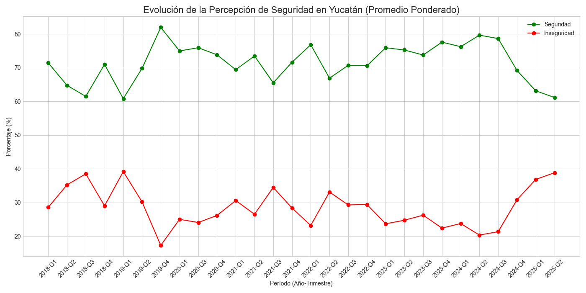
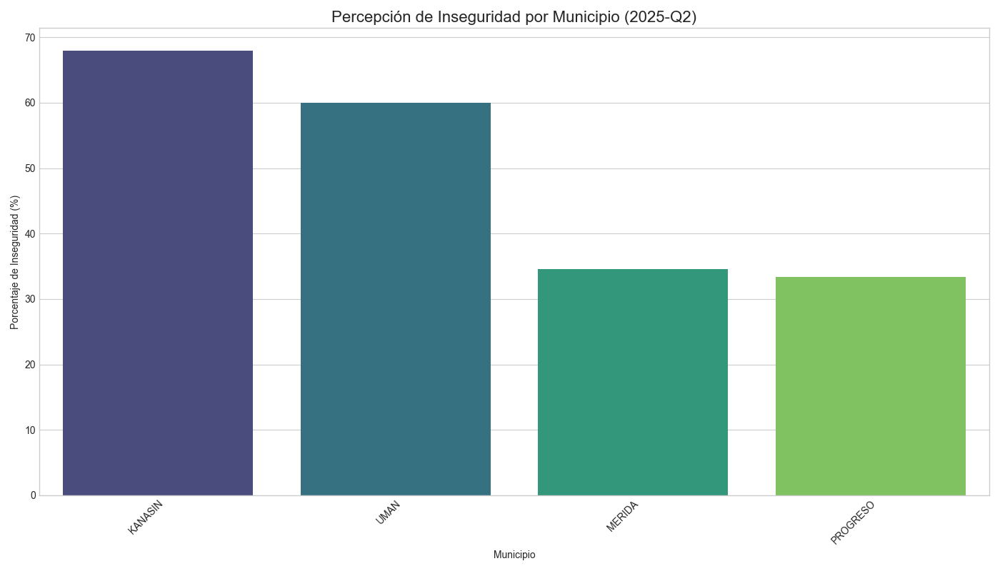
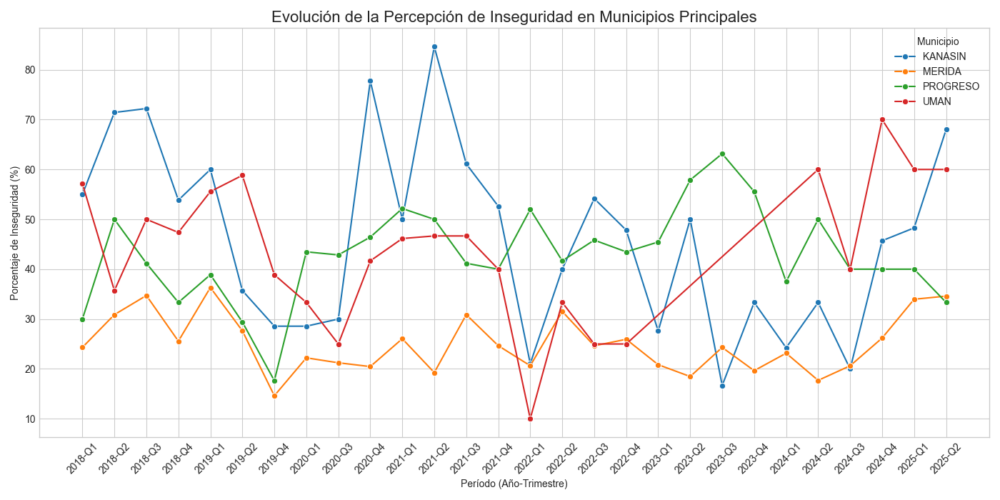
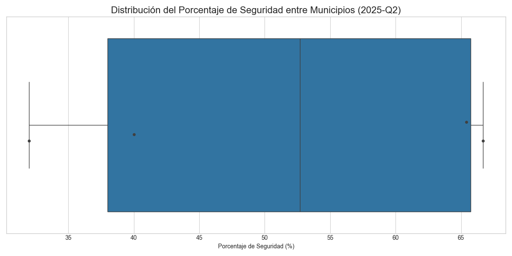

# Reporte de Resultados: Análisis de Percepción de Seguridad en Yucatán

---

## 1. Resumen Ejecutivo

Este documento presenta los hallazgos clave del análisis sobre la percepción de seguridad en el estado de Yucatán, basado en los microdatos de la Encuesta Nacional de Seguridad Pública Urbana (ENSU). El objetivo fue procesar y analizar los datos históricos para identificar tendencias a nivel estatal y municipal.

**Metodología**: Se desarrolló un pipeline de datos automatizado mediante scripts de Python (`process_yucatan_data.py` y `generate_graphs.py`). El proceso consistió en la identificación de datasets relevantes, filtrado de datos exclusivos para Yucatán, normalización y limpieza de la información, y agregación de estadísticas por municipio. Finalmente, se generaron visualizaciones para interpretar los resultados.

**Hallazgos Clave** (basado en el análisis visual):
- Se observa la **tendencia histórica** de la percepción de seguridad e inseguridad a nivel estatal, permitiendo identificar períodos de mejora o deterioro.
- Se han identificado los **municipios con mayor y menor percepción de inseguridad** para el último trimestre disponible, ofreciendo una "fotografía" actual de la situación.
- El análisis de los **municipios principales** revela trayectorias individuales, mostrando que no todas las localidades siguen la misma tendencia que el promedio estatal.
- La **distribución de la percepción** entre los municipios muestra el grado de consenso o disparidad en la seguridad sentida a lo largo del estado.

---

## 2. Metodología

El análisis se fundamentó en un proceso técnico robusto y reproducible.

- **Fuente de Datos**: Microdatos crudos de la ENSU, proporcionados en formato CSV para múltiples años y trimestres.
- **Procesamiento**: Se utilizó el script `process_yucatan_data.py` para:
    1.  Buscar y validar archivos de datos relevantes.
    2.  Filtrar y conservar únicamente los registros pertenecientes a `YUCATAN`.
    3.  Normalizar datos de texto (mayúsculas, sin acentos, `Ñ`->`N`) para asegurar consistencia.
    4.  Limpiar registros con datos inválidos o nulos en las columnas clave (`NOM_MUN`, `BP1_1`).
    5.  Agregar los datos por municipio, calculando totales y porcentajes de percepción.
    6.  Generar un archivo CSV procesado por cada archivo de entrada en la carpeta `data/yucatan-inseguridad/`.
- **Visualización**: Se empleó el script `generate_graphs.py` para leer los datos procesados y generar un conjunto de visualizaciones guardadas en la carpeta `images/`.

---

## 3. Análisis de Resultados

A continuación se presentan y explican los gráficos generados, los cuales constituyen el núcleo de este análisis.

### 3.1. Evolución de la Percepción de Seguridad en Yucatán (General)

**Explicación:**
Este gráfico muestra la tendencia general de la percepción de seguridad y de inseguridad en todo el estado de Yucatán a lo largo del tiempo. Los puntos en la línea verde representan el porcentaje promedio ponderado de la población que se siente "segura", mientras que la línea roja representa a quienes se sienten "inseguros".

- Una **línea verde ascendente** indica una mejora en la percepción de seguridad.
- Una **línea roja ascendente** indica un deterioro en la percepción de seguridad.

Este gráfico es clave para entender la trayectoria histórica y el panorama general del estado.

### 3.2. Comparativa de Inseguridad por Municipio (Trimestre más Reciente)

**Explicación:**
Este diagrama de barras ofrece una comparativa directa de la percepción de inseguridad entre los diferentes municipios de Yucatán durante el último trimestre analizado. Las barras están ordenadas de mayor a menor, facilitando la identificación de los puntos críticos.

- **Barras más altas** señalan a los municipios donde un mayor porcentaje de la población se siente insegura.
- **Barras más bajas** indican una mejor percepción de seguridad.

Este gráfico es útil para focalizar recursos y atención en las áreas que lo requieren con mayor urgencia.

### 3.3. Evolución por Municipios Principales

**Explicación:**
Aquí se desglosa la tendencia de inseguridad a lo largo del tiempo para los cuatro municipios con mayor cantidad de registros en la encuesta. Cada municipio está representado por una línea de color diferente.

Este análisis es importante porque permite observar si las tendencias de los municipios más grandes siguen el promedio estatal o si tienen comportamientos divergentes. Por ejemplo, un municipio podría estar mejorando mientras otro empeora, algo que el gráfico general no mostraría.

### 3.4. Distribución de la Percepción de Seguridad

**Explicación:**
Este gráfico de cajas (box plot) nos ayuda a entender la dispersión de la percepción de seguridad entre todos los municipios para el trimestre más reciente.

- La **caja central** contiene el 50% de los municipios. Una caja ancha significa que hay mucha diferencia entre ellos; una caja estrecha indica que la percepción es muy similar en la mayoría de los municipios.
- La **línea dentro de la caja** representa la mediana (el valor central). 
- Los **puntos individuales** pueden representar municipios con valores atípicamente altos o bajos en comparación con el resto.

---

## 4. Conclusiones

El análisis realizado proporciona una visión multifacética de la percepción de seguridad en Yucatán. Se ha establecido un método automatizado y reproducible para procesar los datos de la ENSU, permitiendo no solo obtener una instantánea actual, sino también monitorear las tendencias a lo largo del tiempo.

Los resultados visuales permiten a los responsables de la toma de decisiones identificar rápidamente tanto las tendencias generales del estado como las problemáticas específicas a nivel municipal, facilitando la asignación de recursos y el diseño de políticas públicas informadas.

## 5. Próximos Pasos

Para enriquecer este análisis a futuro, se podrían considerar las siguientes acciones:

- **Análisis de Correlación**: Incorporar otros datasets (ej. datos demográficos, económicos, incidencia delictiva) para buscar correlaciones con la percepción de seguridad.
- **Modelos Predictivos**: Utilizar las series de tiempo para experimentar con modelos que puedan predecir la tendencia en trimestres futuros.
- **Dashboard Interactivo**: Desarrollar un tablero de control (por ejemplo, con herramientas como Streamlit o Dash) que permita a los usuarios explorar los datos de forma interactiva, filtrando por año o municipio.
