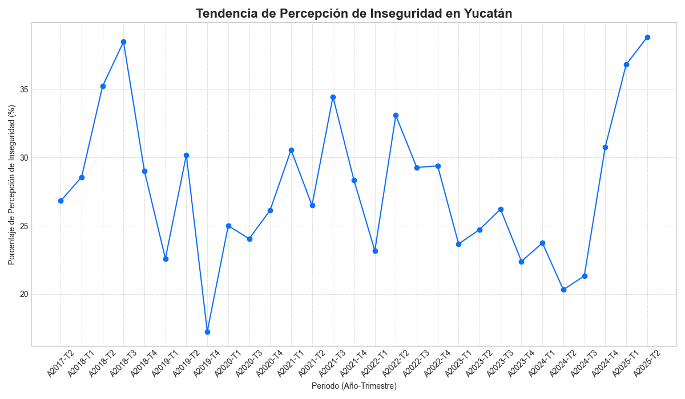

# Reporte de Percepción de Inseguridad - Yucatán

------------------------------------------------------------

**Periodo de Análisis:** De A2017-T2 a A2025-T2.

**Fecha de Generación:** 12 de September de 2025.

## Resumen Ejecutivo

El presente reporte analiza la evolución de la percepción de inseguridad en el estado de Yucatán, consolidando los datos de las encuestas trimestrales. A continuación se presenta el gráfico de tendencia estatal y la tabla de datos completa.

## Tendencia de Inseguridad Estatal

## Tabla de Datos Detallada

| NOM_ENT   | NOM_MUN   |   TOTAL_REGISTROS |   TOTAL_SEGUROS |   TOTAL_INSEGUROS |   TOTAL_NO_RESPONDE |   PCT_SEGUROS |   PCT_INSEGUROS |   PCT_NO_RESPONDE |   AÑO |   TRIMESTRE | Periodo   |
|:----------|:----------|------------------:|----------------:|------------------:|--------------------:|--------------:|----------------:|------------------:|------:|------------:|:----------|
| YUCATAN   | KANASIN   |                19 |               6 |                13 |                   0 |       31.5789 |         68.4211 |          0        |  2017 |           2 | A2017-T2  |
| YUCATAN   | MERIDA    |               216 |             166 |                50 |                   0 |       76.8519 |         23.1481 |          0        |  2017 |           2 | A2017-T2  |
| YUCATAN   | PROGRESO  |                17 |              12 |                 5 |                   0 |       70.5882 |         29.4118 |          0        |  2017 |           2 | A2017-T2  |
| YUCATAN   | UMAN      |                 9 |               7 |                 2 |                   0 |       77.7778 |         22.2222 |          0        |  2017 |           2 | A2017-T2  |
| YUCATAN   | KANASIN   |                20 |               9 |                11 |                   0 |       45      |         55      |          0        |  2018 |           1 | A2018-T1  |
| YUCATAN   | MERIDA    |               222 |             168 |                54 |                   0 |       75.6757 |         24.3243 |          0        |  2018 |           1 | A2018-T1  |
| YUCATAN   | PROGRESO  |                10 |               7 |                 3 |                   0 |       70      |         30      |          0        |  2018 |           1 | A2018-T1  |
| YUCATAN   | UMAN      |                14 |               6 |                 8 |                   0 |       42.8571 |         57.1429 |          0        |  2018 |           1 | A2018-T1  |
| YUCATAN   | KANASIN   |                21 |               6 |                15 |                   0 |       28.5714 |         71.4286 |          0        |  2018 |           2 | A2018-T2  |
| YUCATAN   | MERIDA    |               217 |             150 |                67 |                   0 |       69.1244 |         30.8756 |          0        |  2018 |           2 | A2018-T2  |
| YUCATAN   | PROGRESO  |                12 |               6 |                 6 |                   0 |       50      |         50      |          0        |  2018 |           2 | A2018-T2  |
| YUCATAN   | UMAN      |                14 |               9 |                 5 |                   0 |       64.2857 |         35.7143 |          0        |  2018 |           2 | A2018-T2  |
| YUCATAN   | KANASIN   |                18 |               5 |                13 |                   0 |       27.7778 |         72.2222 |          0        |  2018 |           3 | A2018-T3  |
| YUCATAN   | MERIDA    |               216 |             141 |                75 |                   0 |       65.2778 |         34.7222 |          0        |  2018 |           3 | A2018-T3  |
| YUCATAN   | PROGRESO  |                17 |              10 |                 7 |                   0 |       58.8235 |         41.1765 |          0        |  2018 |           3 | A2018-T3  |
| YUCATAN   | UMAN      |                14 |               7 |                 7 |                   0 |       50      |         50      |          0        |  2018 |           3 | A2018-T3  |
| YUCATAN   | KANASIN   |                13 |               6 |                 7 |                   0 |       46.1538 |         53.8462 |          0        |  2018 |           4 | A2018-T4  |
| YUCATAN   | MERIDA    |               219 |             163 |                56 |                   0 |       74.4292 |         25.5708 |          0        |  2018 |           4 | A2018-T4  |
| YUCATAN   | PROGRESO  |                18 |              12 |                 6 |                   0 |       66.6667 |         33.3333 |          0        |  2018 |           4 | A2018-T4  |
| YUCATAN   | UMAN      |                19 |              10 |                 9 |                   0 |       52.6316 |         47.3684 |          0        |  2018 |           4 | A2018-T4  |
| YUCATAN   | KANASIN   |                15 |               7 |                 8 |                   0 |       46.6667 |         53.3333 |          0        |  2019 |           1 | A2019-T1  |
| YUCATAN   | MERIDA    |               221 |             176 |                45 |                   0 |       79.638  |         20.362  |          0        |  2019 |           1 | A2019-T1  |
| YUCATAN   | PROGRESO  |                17 |              11 |                 6 |                   0 |       64.7059 |         35.2941 |          0        |  2019 |           1 | A2019-T1  |
| YUCATAN   | UMAN      |                17 |              15 |                 2 |                   0 |       88.2353 |         11.7647 |          0        |  2019 |           1 | A2019-T1  |
| YUCATAN   | KANASIN   |                14 |               9 |                 5 |                   0 |       64.2857 |         35.7143 |          0        |  2019 |           2 | A2019-T2  |
| YUCATAN   | MERIDA    |               217 |             157 |                60 |                   0 |       72.3502 |         27.6498 |          0        |  2019 |           2 | A2019-T2  |
| YUCATAN   | PROGRESO  |                17 |              12 |                 5 |                   0 |       70.5882 |         29.4118 |          0        |  2019 |           2 | A2019-T2  |
| YUCATAN   | UMAN      |                17 |               7 |                10 |                   0 |       41.1765 |         58.8235 |          0        |  2019 |           2 | A2019-T2  |
| YUCATAN   | KANASIN   |                14 |              10 |                 4 |                   0 |       71.4286 |         28.5714 |          0        |  2019 |           4 | A2019-T4  |
| YUCATAN   | MERIDA    |               212 |             179 |                31 |                   2 |       84.434  |         14.6226 |          0.943396 |  2019 |           4 | A2019-T4  |
| YUCATAN   | PROGRESO  |                17 |              14 |                 3 |                   0 |       82.3529 |         17.6471 |          0        |  2019 |           4 | A2019-T4  |
| YUCATAN   | UMAN      |                18 |              11 |                 7 |                   0 |       61.1111 |         38.8889 |          0        |  2019 |           4 | A2019-T4  |
| YUCATAN   | KANASIN   |                 7 |               5 |                 2 |                   0 |       71.4286 |         28.5714 |          0        |  2020 |           1 | A2020-T1  |
| YUCATAN   | MERIDA    |               216 |             168 |                48 |                   0 |       77.7778 |         22.2222 |          0        |  2020 |           1 | A2020-T1  |
| YUCATAN   | PROGRESO  |                23 |              13 |                10 |                   0 |       56.5217 |         43.4783 |          0        |  2020 |           1 | A2020-T1  |
| YUCATAN   | UMAN      |                18 |              12 |                 6 |                   0 |       66.6667 |         33.3333 |          0        |  2020 |           1 | A2020-T1  |
| YUCATAN   | KANASIN   |                10 |               7 |                 3 |                   0 |       70      |         30      |          0        |  2020 |           3 | A2020-T3  |
| YUCATAN   | MERIDA    |               212 |             167 |                45 |                   0 |       78.7736 |         21.2264 |          0        |  2020 |           3 | A2020-T3  |
| YUCATAN   | PROGRESO  |                28 |              16 |                12 |                   0 |       57.1429 |         42.8571 |          0        |  2020 |           3 | A2020-T3  |
| YUCATAN   | UMAN      |                12 |               9 |                 3 |                   0 |       75      |         25      |          0        |  2020 |           3 | A2020-T3  |
| YUCATAN   | KANASIN   |                 9 |               2 |                 7 |                   0 |       22.2222 |         77.7778 |          0        |  2020 |           4 | A2020-T4  |
| YUCATAN   | MERIDA    |               215 |             171 |                44 |                   0 |       79.5349 |         20.4651 |          0        |  2020 |           4 | A2020-T4  |
| YUCATAN   | PROGRESO  |                28 |              15 |                13 |                   0 |       53.5714 |         46.4286 |          0        |  2020 |           4 | A2020-T4  |
| YUCATAN   | UMAN      |                12 |               7 |                 5 |                   0 |       58.3333 |         41.6667 |          0        |  2020 |           4 | A2020-T4  |
| YUCATAN   | KANASIN   |                14 |               7 |                 7 |                   0 |       50      |         50      |          0        |  2021 |           1 | A2021-T1  |
| YUCATAN   | MERIDA    |               215 |             159 |                56 |                   0 |       73.9535 |         26.0465 |          0        |  2021 |           1 | A2021-T1  |
| YUCATAN   | PROGRESO  |                23 |              11 |                12 |                   0 |       47.8261 |         52.1739 |          0        |  2021 |           1 | A2021-T1  |
| YUCATAN   | UMAN      |                13 |               7 |                 6 |                   0 |       53.8462 |         46.1538 |          0        |  2021 |           1 | A2021-T1  |
| YUCATAN   | KANASIN   |                13 |               2 |                11 |                   0 |       15.3846 |         84.6154 |          0        |  2021 |           2 | A2021-T2  |
| YUCATAN   | MERIDA    |               218 |             176 |                42 |                   0 |       80.7339 |         19.2661 |          0        |  2021 |           2 | A2021-T2  |
| YUCATAN   | PROGRESO  |                22 |              11 |                11 |                   0 |       50      |         50      |          0        |  2021 |           2 | A2021-T2  |
| YUCATAN   | UMAN      |                15 |               8 |                 7 |                   0 |       53.3333 |         46.6667 |          0        |  2021 |           2 | A2021-T2  |
| YUCATAN   | KANASIN   |                18 |               7 |                11 |                   0 |       38.8889 |         61.1111 |          0        |  2021 |           3 | A2021-T3  |
| YUCATAN   | MERIDA    |               217 |             150 |                67 |                   0 |       69.1244 |         30.8756 |          0        |  2021 |           3 | A2021-T3  |
| YUCATAN   | PROGRESO  |                17 |              10 |                 7 |                   0 |       58.8235 |         41.1765 |          0        |  2021 |           3 | A2021-T3  |
| YUCATAN   | UMAN      |                15 |               8 |                 7 |                   0 |       53.3333 |         46.6667 |          0        |  2021 |           3 | A2021-T3  |
| YUCATAN   | KANASIN   |                19 |               9 |                10 |                   0 |       47.3684 |         52.6316 |          0        |  2021 |           4 | A2021-T4  |
| YUCATAN   | MERIDA    |               219 |             165 |                54 |                   0 |       75.3425 |         24.6575 |          0        |  2021 |           4 | A2021-T4  |
| YUCATAN   | PROGRESO  |                20 |              12 |                 8 |                   0 |       60      |         40      |          0        |  2021 |           4 | A2021-T4  |
| YUCATAN   | UMAN      |                10 |               6 |                 4 |                   0 |       60      |         40      |          0        |  2021 |           4 | A2021-T4  |
| YUCATAN   | KANASIN   |                19 |              15 |                 4 |                   0 |       78.9474 |         21.0526 |          0        |  2022 |           1 | A2022-T1  |
| YUCATAN   | MERIDA    |               218 |             173 |                45 |                   0 |       79.3578 |         20.6422 |          0        |  2022 |           1 | A2022-T1  |
| YUCATAN   | PROGRESO  |                25 |              12 |                13 |                   0 |       48      |         52      |          0        |  2022 |           1 | A2022-T1  |
| YUCATAN   | UMAN      |                10 |               9 |                 1 |                   0 |       90      |         10      |          0        |  2022 |           1 | A2022-T1  |
| YUCATAN   | KANASIN   |                20 |              12 |                 8 |                   0 |       60      |         40      |          0        |  2022 |           2 | A2022-T2  |
| YUCATAN   | MERIDA    |               222 |             152 |                70 |                   0 |       68.4685 |         31.5315 |          0        |  2022 |           2 | A2022-T2  |
| YUCATAN   | PROGRESO  |                24 |              14 |                10 |                   0 |       58.3333 |         41.6667 |          0        |  2022 |           2 | A2022-T2  |
| YUCATAN   | UMAN      |                 9 |               6 |                 3 |                   0 |       66.6667 |         33.3333 |          0        |  2022 |           2 | A2022-T2  |
| YUCATAN   | KANASIN   |                24 |              11 |                13 |                   0 |       45.8333 |         54.1667 |          0        |  2022 |           3 | A2022-T3  |
| YUCATAN   | MERIDA    |               211 |             159 |                52 |                   0 |       75.3555 |         24.6445 |          0        |  2022 |           3 | A2022-T3  |
| YUCATAN   | PROGRESO  |                24 |              13 |                11 |                   0 |       54.1667 |         45.8333 |          0        |  2022 |           3 | A2022-T3  |
| YUCATAN   | UMAN      |                 4 |               3 |                 1 |                   0 |       75      |         25      |          0        |  2022 |           3 | A2022-T3  |
| YUCATAN   | KANASIN   |                23 |              12 |                11 |                   0 |       52.1739 |         47.8261 |          0        |  2022 |           4 | A2022-T4  |
| YUCATAN   | MERIDA    |               212 |             157 |                55 |                   0 |       74.0566 |         25.9434 |          0        |  2022 |           4 | A2022-T4  |
| YUCATAN   | PROGRESO  |                23 |              13 |                10 |                   0 |       56.5217 |         43.4783 |          0        |  2022 |           4 | A2022-T4  |
| YUCATAN   | UMAN      |                 4 |               3 |                 1 |                   0 |       75      |         25      |          0        |  2022 |           4 | A2022-T4  |
| YUCATAN   | KANASIN   |                29 |              21 |                 8 |                   0 |       72.4138 |         27.5862 |          0        |  2023 |           1 | A2023-T1  |
| YUCATAN   | MERIDA    |               211 |             166 |                44 |                   1 |       78.673  |         20.8531 |          0.473934 |  2023 |           1 | A2023-T1  |
| YUCATAN   | PROGRESO  |                22 |              12 |                10 |                   0 |       54.5455 |         45.4545 |          0        |  2023 |           1 | A2023-T1  |
| YUCATAN   | KANASIN   |                30 |              15 |                15 |                   0 |       50      |         50      |          0        |  2023 |           2 | A2023-T2  |
| YUCATAN   | MERIDA    |               222 |             181 |                41 |                   0 |       81.5315 |         18.4685 |          0        |  2023 |           2 | A2023-T2  |
| YUCATAN   | PROGRESO  |                19 |               8 |                11 |                   0 |       42.1053 |         57.8947 |          0        |  2023 |           2 | A2023-T2  |
| YUCATAN   | KANASIN   |                30 |              25 |                 5 |                   0 |       83.3333 |         16.6667 |          0        |  2023 |           3 | A2023-T3  |
| YUCATAN   | MERIDA    |               218 |             165 |                53 |                   0 |       75.6881 |         24.3119 |          0        |  2023 |           3 | A2023-T3  |
| YUCATAN   | PROGRESO  |                19 |               7 |                12 |                   0 |       36.8421 |         63.1579 |          0        |  2023 |           3 | A2023-T3  |
| YUCATAN   | KANASIN   |                30 |              20 |                10 |                   0 |       66.6667 |         33.3333 |          0        |  2023 |           4 | A2023-T4  |
| YUCATAN   | MERIDA    |               229 |             184 |                45 |                   0 |       80.3493 |         19.6507 |          0        |  2023 |           4 | A2023-T4  |
| YUCATAN   | PROGRESO  |                 9 |               4 |                 5 |                   0 |       44.4444 |         55.5556 |          0        |  2023 |           4 | A2023-T4  |
| YUCATAN   | KANASIN   |                33 |              25 |                 8 |                   0 |       75.7576 |         24.2424 |          0        |  2024 |           1 | A2024-T1  |
| YUCATAN   | MERIDA    |               216 |             166 |                50 |                   0 |       76.8519 |         23.1481 |          0        |  2024 |           1 | A2024-T1  |
| YUCATAN   | PROGRESO  |                 8 |               5 |                 3 |                   0 |       62.5    |         37.5    |          0        |  2024 |           1 | A2024-T1  |
| YUCATAN   | KANASIN   |                21 |              14 |                 7 |                   0 |       66.6667 |         33.3333 |          0        |  2024 |           2 | A2024-T2  |
| YUCATAN   | MERIDA    |               226 |             186 |                40 |                   0 |       82.3009 |         17.6991 |          0        |  2024 |           2 | A2024-T2  |
| YUCATAN   | PROGRESO  |                 4 |               2 |                 2 |                   0 |       50      |         50      |          0        |  2024 |           2 | A2024-T2  |
| YUCATAN   | UMAN      |                 5 |               2 |                 3 |                   0 |       40      |         60      |          0        |  2024 |           2 | A2024-T2  |
| YUCATAN   | KANASIN   |                25 |              20 |                 5 |                   0 |       80      |         20      |          0        |  2024 |           3 | A2024-T3  |
| YUCATAN   | MERIDA    |               223 |             177 |                46 |                   0 |       79.3722 |         20.6278 |          0        |  2024 |           3 | A2024-T3  |
| YUCATAN   | PROGRESO  |                 5 |               3 |                 2 |                   0 |       60      |         40      |          0        |  2024 |           3 | A2024-T3  |
| YUCATAN   | UMAN      |                 5 |               3 |                 2 |                   0 |       60      |         40      |          0        |  2024 |           3 | A2024-T3  |
| YUCATAN   | KANASIN   |                35 |              19 |                16 |                   0 |       54.2857 |         45.7143 |          0        |  2024 |           4 | A2024-T4  |
| YUCATAN   | MERIDA    |               210 |             155 |                55 |                   0 |       73.8095 |         26.1905 |          0        |  2024 |           4 | A2024-T4  |
| YUCATAN   | PROGRESO  |                 5 |               3 |                 2 |                   0 |       60      |         40      |          0        |  2024 |           4 | A2024-T4  |
| YUCATAN   | UMAN      |                10 |               3 |                 7 |                   0 |       30      |         70      |          0        |  2024 |           4 | A2024-T4  |
| YUCATAN   | KANASIN   |                29 |              15 |                14 |                   0 |       51.7241 |         48.2759 |          0        |  2025 |           1 | A2025-T1  |
| YUCATAN   | MERIDA    |               209 |             138 |                71 |                   0 |       66.0287 |         33.9713 |          0        |  2025 |           1 | A2025-T1  |
| YUCATAN   | PROGRESO  |                10 |               6 |                 4 |                   0 |       60      |         40      |          0        |  2025 |           1 | A2025-T1  |
| YUCATAN   | UMAN      |                10 |               4 |                 6 |                   0 |       40      |         60      |          0        |  2025 |           1 | A2025-T1  |
| YUCATAN   | KANASIN   |                25 |               8 |                17 |                   0 |       32      |         68      |          0        |  2025 |           2 | A2025-T2  |
| YUCATAN   | MERIDA    |               211 |             138 |                73 |                   0 |       65.4028 |         34.5972 |          0        |  2025 |           2 | A2025-T2  |
| YUCATAN   | PROGRESO  |                 9 |               6 |                 3 |                   0 |       66.6667 |         33.3333 |          0        |  2025 |           2 | A2025-T2  |
| YUCATAN   | UMAN      |                10 |               4 |                 6 |                   0 |       40      |         60      |          0        |  2025 |           2 | A2025-T2  |

## Conclusiones

_(Espacio reservado para el análisis y las conclusiones derivadas de los datos presentados.)_