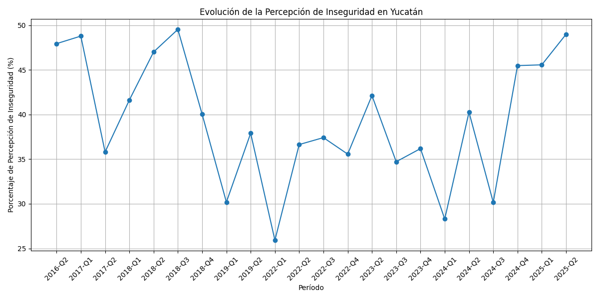
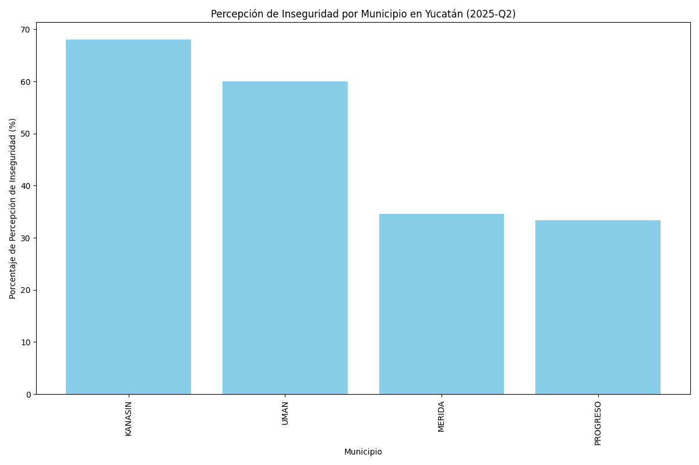
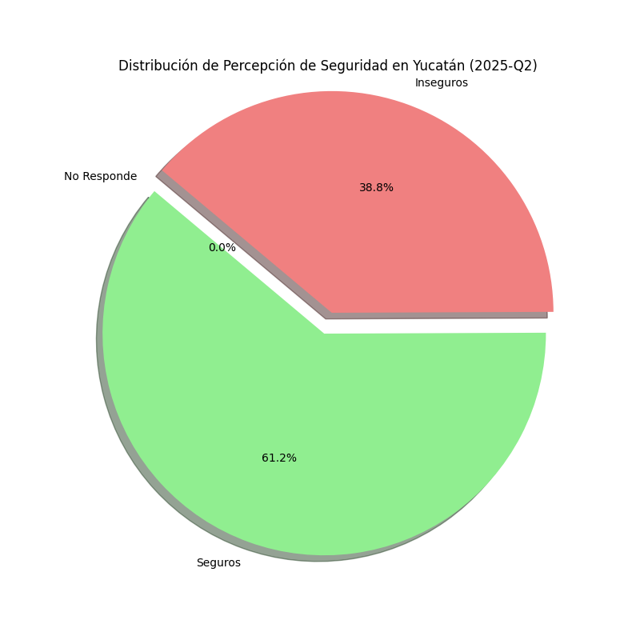

# Análisis de Percepción de Inseguridad en Yucatán

Este reporte presenta un análisis visual de la percepción de la seguridad en el estado de Yucatán, basado en los datos procesados de la Encuesta Nacional de Seguridad Pública Urbana (ENSU).

## 1. Evolución de la Percepción de Inseguridad

La siguiente gráfica muestra la tendencia del porcentaje de la población que se siente insegura en Yucatán a lo largo de los diferentes trimestres.



**Observaciones:**
- (Aquí se podrían añadir observaciones sobre si la tendencia es al alza, a la baja o estable).

## 2. Comparativa por Municipio (Período 2025-Q2)

A continuación, se presenta una comparación de la percepción de inseguridad entre los municipios de Yucatán para el período más reciente disponible.



**Observaciones:**
- (Observaciones sobre qué municipios tienen mayor o menor percepción de inseguridad).

## 3. Distribución General de la Percepción (2025-Q2)

La siguiente gráfica de pastel ilustra la distribución de las respuestas sobre la percepción de seguridad en todo el estado para el último período.



## 4. Datos Detallados del Último Período

A continuación se muestra la tabla de datos detallados por municipio para el período 2025-Q2.

```
+--------+-----------+-------------+---------------+
| NOM_MUN|PCT_SEGUROS|PCT_INSEGUROS|PCT_NO_RESPONDE|
+--------+-----------+-------------+---------------+
| KANASIN|    32.0   |     68.0    |      0.0      |
+--------+-----------+-------------+---------------+
| MERIDA |    65.4   |     34.6    |      0.0      |
+--------+-----------+-------------+---------------+
|PROGRESO|   66.67   |    33.33    |      0.0      |
+--------+-----------+-------------+---------------+
|  UMAN  |    40.0   |     60.0    |      0.0      |
+--------+-----------+-------------+---------------+```

