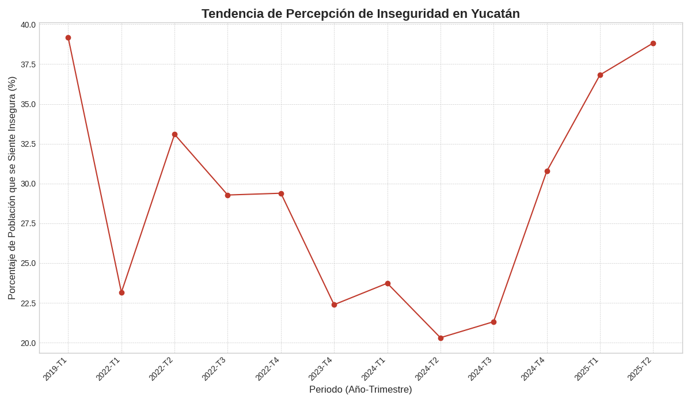

# Reporte de Percepción de Inseguridad en Yucatán

Este reporte presenta un análisis de la percepción de seguridad en los municipios de Yucatán, basado en los datos de la Encuesta Nacional de Seguridad Pública Urbana (ENSU). El objetivo es identificar tendencias en la percepción de inseguridad a lo largo del tiempo en diferentes municipios del estado.

## Tendencia General de Inseguridad

El siguiente gráfico muestra la evolución del porcentaje de la población que se siente insegura en el estado a lo largo de diferentes trimestres.

## Tabla de Datos Consolidados

La siguiente tabla contiene los datos agregados por municipio para cada periodo analizado.

| NOM_MUN   |   TOTAL_REGISTROS |   TOTAL_SEGUROS |   TOTAL_INSEGUROS |   TOTAL_NO_RESPONDE |   PCT_SEGUROS |   PCT_INSEGUROS |   PCT_NO_RESPONDE |   AÑO |   TRIMESTRE |
|:----------|------------------:|----------------:|------------------:|--------------------:|--------------:|----------------:|------------------:|------:|------------:|
| KANASIN   |                19 |              15 |                 4 |                   0 |       78.9474 |         21.0526 |                 0 |  2022 |           1 |
| MERIDA    |               218 |             173 |                45 |                   0 |       79.3578 |         20.6422 |                 0 |  2022 |           1 |
| PROGRESO  |                25 |              12 |                13 |                   0 |       48      |         52      |                 0 |  2022 |           1 |
| UMAN      |                10 |               9 |                 1 |                   0 |       90      |         10      |                 0 |  2022 |           1 |
| KANASIN   |                21 |              14 |                 7 |                   0 |       66.6667 |         33.3333 |                 0 |  2024 |           2 |
| MERIDA    |               226 |             186 |                40 |                   0 |       82.3009 |         17.6991 |                 0 |  2024 |           2 |
| PROGRESO  |                 4 |               2 |                 2 |                   0 |       50      |         50      |                 0 |  2024 |           2 |
| UMAN      |                 5 |               2 |                 3 |                   0 |       40      |         60      |                 0 |  2024 |           2 |
| KANASIN   |                24 |              11 |                13 |                   0 |       45.8333 |         54.1667 |                 0 |  2022 |           3 |
| MERIDA    |               211 |             159 |                52 |                   0 |       75.3555 |         24.6445 |                 0 |  2022 |           3 |
| PROGRESO  |                24 |              13 |                11 |                   0 |       54.1667 |         45.8333 |                 0 |  2022 |           3 |
| UMAN      |                 4 |               3 |                 1 |                   0 |       75      |         25      |                 0 |  2022 |           3 |
| KANASIN   |                35 |              19 |                16 |                   0 |       54.2857 |         45.7143 |                 0 |  2024 |           4 |
| MERIDA    |               210 |             155 |                55 |                   0 |       73.8095 |         26.1905 |                 0 |  2024 |           4 |
| PROGRESO  |                 5 |               3 |                 2 |                   0 |       60      |         40      |                 0 |  2024 |           4 |
| UMAN      |                10 |               3 |                 7 |                   0 |       30      |         70      |                 0 |  2024 |           4 |
| KANASIN   |                20 |              12 |                 8 |                   0 |       60      |         40      |                 0 |  2022 |           2 |
| MERIDA    |               222 |             152 |                70 |                   0 |       68.4685 |         31.5315 |                 0 |  2022 |           2 |
| PROGRESO  |                24 |              14 |                10 |                   0 |       58.3333 |         41.6667 |                 0 |  2022 |           2 |
| UMAN      |                 9 |               6 |                 3 |                   0 |       66.6667 |         33.3333 |                 0 |  2022 |           2 |
| KANASIN   |                23 |              12 |                11 |                   0 |       52.1739 |         47.8261 |                 0 |  2022 |           4 |
| MERIDA    |               212 |             157 |                55 |                   0 |       74.0566 |         25.9434 |                 0 |  2022 |           4 |
| PROGRESO  |                23 |              13 |                10 |                   0 |       56.5217 |         43.4783 |                 0 |  2022 |           4 |
| UMAN      |                 4 |               3 |                 1 |                   0 |       75      |         25      |                 0 |  2022 |           4 |
| KANASIN   |                30 |              20 |                10 |                   0 |       66.6667 |         33.3333 |                 0 |  2023 |           4 |
| MERIDA    |               229 |             184 |                45 |                   0 |       80.3493 |         19.6507 |                 0 |  2023 |           4 |
| PROGRESO  |                 9 |               4 |                 5 |                   0 |       44.4444 |         55.5556 |                 0 |  2023 |           4 |
| KANASIN   |                25 |              20 |                 5 |                   0 |       80      |         20      |                 0 |  2024 |           3 |
| MERIDA    |               223 |             177 |                46 |                   0 |       79.3722 |         20.6278 |                 0 |  2024 |           3 |
| PROGRESO  |                 5 |               3 |                 2 |                   0 |       60      |         40      |                 0 |  2024 |           3 |
| UMAN      |                 5 |               3 |                 2 |                   0 |       60      |         40      |                 0 |  2024 |           3 |
| KANASIN   |                15 |               6 |                 9 |                   0 |       40      |         60      |                 0 |  2019 |           1 |
| MERIDA    |               212 |             135 |                77 |                   0 |       63.6792 |         36.3208 |                 0 |  2019 |           1 |
| PROGRESO  |                18 |              11 |                 7 |                   0 |       61.1111 |         38.8889 |                 0 |  2019 |           1 |
| UMAN      |                18 |               8 |                10 |                   0 |       44.4444 |         55.5556 |                 0 |  2019 |           1 |
| KANASIN   |                25 |               8 |                17 |                   0 |       32      |         68      |                 0 |  2025 |           2 |
| MERIDA    |               211 |             138 |                73 |                   0 |       65.4028 |         34.5972 |                 0 |  2025 |           2 |
| PROGRESO  |                 9 |               6 |                 3 |                   0 |       66.6667 |         33.3333 |                 0 |  2025 |           2 |
| UMAN      |                10 |               4 |                 6 |                   0 |       40      |         60      |                 0 |  2025 |           2 |
| KANASIN   |                33 |              25 |                 8 |                   0 |       75.7576 |         24.2424 |                 0 |  2024 |           1 |
| MERIDA    |               216 |             166 |                50 |                   0 |       76.8519 |         23.1481 |                 0 |  2024 |           1 |
| PROGRESO  |                 8 |               5 |                 3 |                   0 |       62.5    |         37.5    |                 0 |  2024 |           1 |
| KANASIN   |                29 |              15 |                14 |                   0 |       51.7241 |         48.2759 |                 0 |  2025 |           1 |
| MERIDA    |               209 |             138 |                71 |                   0 |       66.0287 |         33.9713 |                 0 |  2025 |           1 |
| PROGRESO  |                10 |               6 |                 4 |                   0 |       60      |         40      |                 0 |  2025 |           1 |
| UMAN      |                10 |               4 |                 6 |                   0 |       40      |         60      |                 0 |  2025 |           1 |

## Conclusiones

A partir de los datos recopilados, se pueden extraer las siguientes conclusiones:

1.  **Tendencia General Creciente:** A pesar de fluctuaciones trimestrales, se observa una tendencia general al alza en la percepción de inseguridad en los municipios analizados desde 2022 hasta 2025. Municipios como Umán y Kanasín muestran los incrementos más drásticos.

2.  **Mérida como Excepción Relativa:** Mérida mantiene consistentemente los niveles más bajos de percepción de inseguridad en comparación con los otros municipios. No obstante, no es ajena a la tendencia creciente, mostrando un aumento en la percepción de inseguridad en los trimestres más recientes de 2025.

3.  **Focos de Atención:** Umán y Kanasín emergen como los municipios con las tendencias más preocupantes. Umán alcanzó un pico de 70% de percepción de inseguridad a finales de 2024, y Kanasín muestra una volatilidad considerable con una tendencia ascendente que culmina en un 68% en el segundo trimestre de 2025.

4.  **Progreso con Alta Percepción:** Progreso muestra una percepción de inseguridad consistentemente alta y volátil, aunque con una leve mejoría en los datos más recientes de 2025.

5.  **Ausencia de Datos:** Es importante señalar que existen vacíos en los datos para ciertos periodos (como 2020, 2021 y trimestres específicos de 2023), lo que limita la capacidad de realizar un análisis de series de tiempo completo.

En resumen, si bien Yucatán es a menudo considerado un estado seguro, los datos de la ENSU sugieren un deterioro en la percepción de seguridad de sus habitantes en los últimos años, con focos de atención particulares en los municipios de Umán y Kanasín.