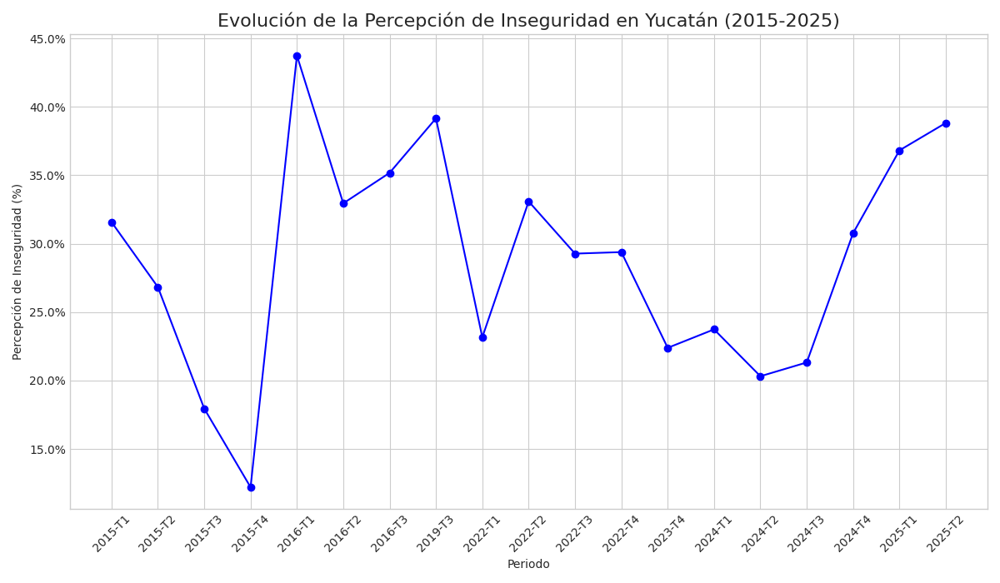
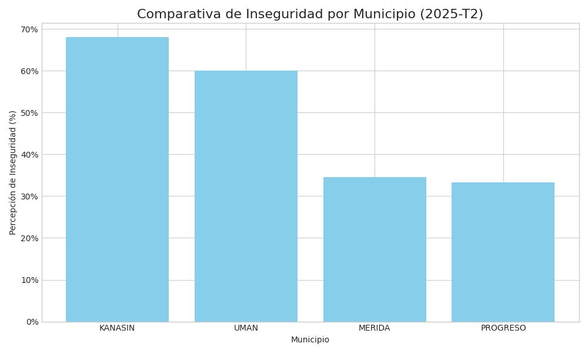
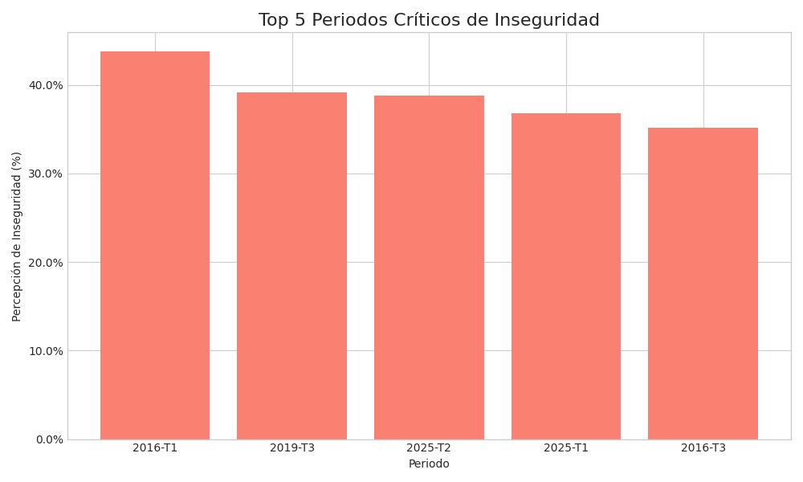

# Detailed Analysis of the Perception of Insecurity in Yucatan (2015-2025)

---

## Executive Summary

This report provides a comprehensive analysis of the public perception of insecurity in the state of Yucatan, using quarterly data from the National Survey of Urban Public Safety (ENSU) collected between 2015 and 2025. The objective is to identify trends, patterns, and anomalies in citizen perception to provide a quantitative basis that can inform future security strategies and studies.

Key findings reveal a notable fluctuation in the perception of insecurity throughout the decade, with significant peaks in 2016 and a worrying resurgence in 2025. Additionally, there is considerable disparity among the analyzed municipalities, with Kanasín and Umán identified as hotspots of high insecurity perception in the most recent period. The analysis concludes with a series of recommendations aimed at resource allocation and the need for complementary qualitative studies.

---

## 1. Historical Evolution of the Perception of Insecurity

Time-series analysis is fundamental to understanding the behavior of insecurity perception beyond static measurements. The following chart illustrates the weighted average of the population that reported feeling insecure in Yucatan.

### Trend Interpretation

The evolution of the perception of insecurity in Yucatan has not been linear. Several key behaviors can be identified:

- **2016 Peak:** The first quarter of 2016 represents the highest point of perceived insecurity in the entire analysis period, reaching **43.75%**. This outlier suggests the possible influence of specific socio-political or public security events of that year that generated particular alarm among the population.
- **Period of Low Perception (2015):** The year 2015, in contrast, showed a downward trend, ending the year with a historical minimum of just **12.20%** in the fourth quarter.
- **Recent Trend (2024-2025):** It is imperative to note the **significant rebound** in the latest recorded quarters. The perception of insecurity has climbed from 20.31% in mid-2024 to **38.83%** in the second quarter of 2025, approaching historical highs. This upward trend requires continuous attention and monitoring.

### Detailed Evolution Data

| Period  | Average Insecurity (%) |
|:--------|:-----------------------|
| 2015-Q1 | 31.58                  |
| 2015-Q2 | 26.83                  |
| 2015-Q3 | 17.95                  |
| 2015-Q4 | 12.20                  |
| 2016-Q1 | 43.75                  |
| 2016-Q2 | 32.95                  |
| 2016-Q3 | 35.18                  |
| 2019-Q3 | 39.16                  |
| 2022-Q1 | 23.16                  |
| 2022-Q2 | 33.09                  |
| 2022-Q3 | 29.27                  |
| 2022-Q4 | 29.39                  |
| 2023-Q4 | 22.39                  |
| 2024-Q1 | 23.74                  |
| 2024-Q2 | 20.31                  |
| 2024-Q3 | 21.32                  |
| 2024-Q4 | 30.77                  |
| 2025-Q1 | 36.82                  |
| 2025-Q2 | 38.83                  |

---

## 2. Comparative Analysis between Municipalities

The perception of insecurity is not homogeneous across the state. Geographic analysis reveals significant differences between municipalities, underscoring the need for localized security strategies. The chart below compares the perception of insecurity in the most recent quarter (2025-Q2).

### Interpretation of Disparities

Data from the second quarter of 2025 shows a clear gap in municipal insecurity perception:

- **Hotspots of High Perception:** **Kanasín (68.00%)** and **Umán (60.00%)** stand out as the municipalities with the highest levels of perceived insecurity. In Kanasín, nearly 7 out of 10 citizens feel insecure, an alarming figure that doubles the average of other municipalities.
- **Moderate Levels:** **Mérida (34.60%)** and **Progreso (33.33%)** show considerably lower, though still relevant, levels. The perception in the capital, Mérida, is almost half that recorded in its neighbor Kanasín.

This disparity suggests that the factors driving the perception of insecurity are eminently local and that public security policies could benefit from a differentiated approach that addresses the specific problems of each area.

### Detailed Comparison Data (2025-Q2)

| Municipality | Perception of Insecurity (%) |
|:-------------|:-----------------------------|
| KANASIN      | 68.00                        |
| UMAN         | 60.00                        |
| MERIDA       | 34.60                        |
| PROGRESO     | 33.33                        |

---

## 3. Identification of Historical Critical Periods

Identifying moments of greatest social tension is key to planning and prevention. This analysis highlights the five quarters with the highest peaks in the perception of insecurity over the last decade.

### Interpretation of Critical Points

The periods of greatest citizen concern for security have been:

1.  **2016-Q1 (43.75%):** The highest point in the entire historical series.
2.  **2019-Q3 (39.16%):** Another important peak at the end of the last decade.
3.  **2025-Q2 (38.83%):** The most recent quarter, confirming the current upward trend.
4.  **2025-Q1 (36.82%):** The beginning of 2025 already showed a high perception.
5.  **2016-Q3 (35.18%):** The year 2016 appears twice in this ranking, consolidating it as a year of high tension.

Analyzing these periods is crucial to understanding the triggering factors (economic crises, high-impact crime events, etc.) that can exacerbate the perceived insecurity and to developing more robust preventive strategies.

---

## 4. Methodological Considerations and Potential Errors

To ensure a transparent and critical interpretation of the results, this section addresses potential sources of error, both from the data processing phase and from the intrinsic methodology of the source survey.

### 4.1. Potential Data Processing Errors

- **Missing Data Imputation:** In the initial data cleaning, records with an empty municipality name were assigned the label 'ESTATAL'. This is a significant assumption. It implies that these records represent a state-level summary, but they could also be data from various unspecified municipalities. This could mask local variations and group dissimilar data points.
- **Gaps in the Time Series:** The available data contains significant time gaps (e.g., no records for 2017, 2018, 2020, 2021). The time-series analysis graph connects the available data points (e.g., 2016 to 2019), which can create a misleading visual of a smooth, continuous trend. The reality is that the behavior during these multi-year gaps is unknown and cannot be inferred from the chart.
- **Handling of Null Values:** The processing script converts empty strings to null values (`NaN`) and subsequently drops any rows where key metrics like `PCT_INSEGUROS` are missing. While this prevents calculation errors, it might hide underlying data quality issues. If nulls were represented by other placeholders (e.g., "N/A", "999"), this data would not be correctly processed, potentially leading to an incomplete dataset.

### 4.2. Potential Methodological Limitations of the Survey (ENSU)

- **Perception vs. Reality:** This is the most critical limitation. The ENSU measures the *perception* of insecurity, not objective, official crime rates. Public perception is highly malleable and can be influenced by media coverage (especially of high-profile crimes), social media discourse, and personal anecdotes, which may not correlate with statistical changes in crime.
- **Urban-Centric Focus:** The survey's official name, National Survey of *Urban* Public Safety, indicates its scope. The results are representative of urban centers in Yucatan (like Mérida, Kanasín, etc.) but not of rural communities. Therefore, these findings cannot be generalized to the entire state population, as the experiences and security challenges in rural areas can be vastly different.
- **Sampling and Response Bias:** Like any survey, ENSU is susceptible to biases. **Response bias** may occur if individuals who have recently been victims of a crime or who feel particularly strong about the issue are more likely to participate. Conversely, some citizens may not respond honestly due to distrust of authorities or fear of reprisal.
- **Methodological Consistency:** Over a decade-long period, the survey's methodology (e.g., question wording, sampling techniques, collection methods) may have undergone changes. Such modifications could impact the direct comparability of data from earlier years (e.g., 2015) with more recent data (e.g., 2025), potentially affecting long-term trend analysis.

---

## Conclusions and Recommendations

This quantitative analysis of ENSU data for Yucatan yields three main conclusions:

1.  **The perception of insecurity is volatile and sensitive to circumstantial factors**, as demonstrated by the 2016 peaks and the recent escalation in 2025. It cannot be assumed to be a static indicator.
2.  **There is a marked territorial inequality in the perception of insecurity.** Municipalities like Kanasín and Umán face a significantly greater challenge than Mérida and Progreso, demanding an analysis of the underlying causes at the local level.
3.  **The current trend is upward and requires monitoring.** The rapid increase in the perception of insecurity between 2024 and 2025 is a warning sign that should not be underestimated.

Based on these findings, the following **recommendations** are issued:

- **Deepen the Analysis:** It is recommended to complement this quantitative study with a **qualitative analysis** (interviews, focus groups) in the municipalities with the highest rates to understand the root causes of the perception of insecurity (e.g., lack of street lighting, distrust in the police, specific crimes).
- **Focus Strategies:** Public security and crime prevention policies should consider a **differentiated allocation of resources and strategies** by municipality, with a priority focus on areas identified as hotspots of high perception.
- **Continuous Monitoring:** It is crucial to maintain **active monitoring of the upward trend** observed in 2025 to evaluate the effectiveness of implemented measures and anticipate future crises.