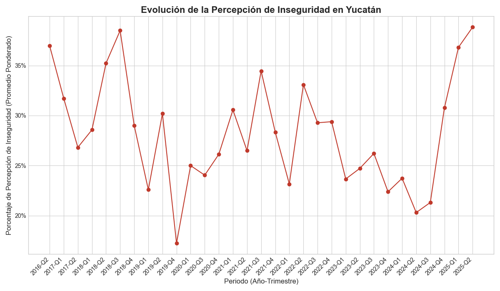

# Análisis de Percepción de Inseguridad en Yucatán

Este reporte presenta la evolución de la percepción de inseguridad en el estado de Yucatán, basada en los datos procesados de la ENSU. 
La métrica principal es el porcentaje de la población que percibe su entorno como inseguro, ponderado por el número de encuestados en cada municipio para obtener una visión a nivel estatal.

## Datos Agregados por Periodo

A continuación se muestra la tabla con el porcentaje de percepción de inseguridad a nivel estatal para cada periodo:

| PERIODO   | PCT_INSEGURIDAD_ESTATAL_FORMAT   |
|:----------|:---------------------------------|
| 2016-Q2   | 37.0%                            |
| 2017-Q1   | 31.7%                            |
| 2017-Q2   | 26.8%                            |
| 2018-Q1   | 28.6%                            |
| 2018-Q2   | 35.2%                            |
| 2018-Q3   | 38.5%                            |
| 2018-Q4   | 29.0%                            |
| 2019-Q1   | 22.6%                            |
| 2019-Q2   | 30.2%                            |
| 2019-Q4   | 17.2%                            |
| 2020-Q1   | 25.0%                            |
| 2020-Q3   | 24.0%                            |
| 2020-Q4   | 26.1%                            |
| 2021-Q1   | 30.6%                            |
| 2021-Q2   | 26.5%                            |
| 2021-Q3   | 34.5%                            |
| 2021-Q4   | 28.4%                            |
| 2022-Q1   | 23.2%                            |
| 2022-Q2   | 33.1%                            |
| 2022-Q3   | 29.3%                            |
| 2022-Q4   | 29.4%                            |
| 2023-Q1   | 23.7%                            |
| 2023-Q2   | 24.7%                            |
| 2023-Q3   | 26.2%                            |
| 2023-Q4   | 22.4%                            |
| 2024-Q1   | 23.7%                            |
| 2024-Q2   | 20.3%                            |
| 2024-Q3   | 21.3%                            |
| 2024-Q4   | 30.8%                            |
| 2025-Q1   | 36.8%                            |
| 2025-Q2   | 38.8%                            |

## Evolución de la Percepción de Inseguridad

La siguiente gráfica ilustra la tendencia a lo largo del tiempo.

## Conclusión

El análisis de los datos desde 2016-Q2 hasta 2025-Q2 revela varias tendencias clave en la percepción de inseguridad en Yucatán.

El punto más alto de inseguridad percibida se registró en el periodo **2025-Q2**, alcanzando un **38.8%**.
En general, la gráfica muestra una **tendencia al alza** en la percepción de inseguridad a lo largo del tiempo, a pesar de fluctuaciones trimestrales.