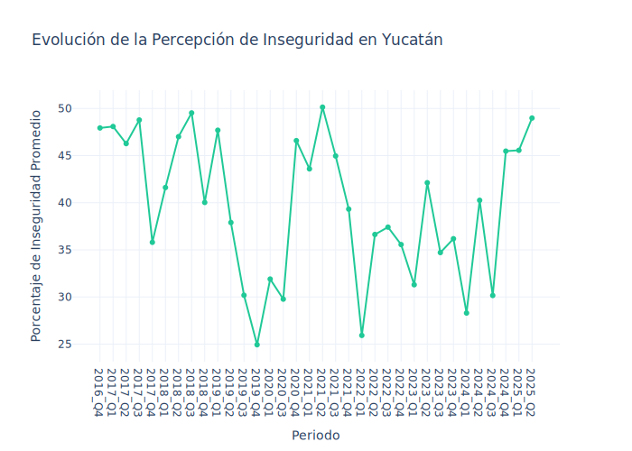
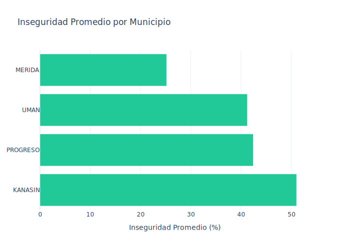

# Reporte de Percepción de Seguridad en Yucatán

*Fecha de generación: 13 de September de 2025*

## Introducción
Este reporte presenta un análisis de la percepción de seguridad en el estado de Yucatán, basado en los datos históricos de la Encuesta Nacional de Seguridad Pública Urbana (ENSU) del INEGI. El objetivo es consolidar y visualizar las tendencias a lo largo del tiempo y comparar los niveles de percepción de inseguridad entre los diferentes municipios del estado para los cuales se encontraron datos.

## Resumen Ejecutivo

> **Municipio con Mayor Inseguridad (Promedio):** KANASIN con un **51.03%**.
> **Municipio con Menor Inseguridad (Promedio):** MERIDA con un **25.17%**.

A continuación, se presentan los análisis detallados que sustentan estos resultados.

## Evolución de la Percepción de Inseguridad en Yucatán

El siguiente gráfico de líneas muestra cómo ha variado el promedio estatal de la percepción de inseguridad a lo largo de los trimestres. Este promedio se calcula a partir de los datos de todos los municipios disponibles en cada periodo. La visualización permite identificar fácilmente tendencias, picos o valles en la percepción de seguridad de los ciudadanos en el estado.

## Comparativa de Inseguridad por Municipio

Para entender las diferencias regionales dentro del estado, el siguiente gráfico de barras clasifica cada municipio según su porcentaje promedio de percepción de inseguridad, calculado a partir de todos los periodos analizados. Esto permite una comparación directa y clara sobre qué municipios son percibidos como más o menos seguros por sus habitantes a lo largo del tiempo.

## Datos Detallados

La siguiente tabla contiene los datos agregados por municipio y periodo que fueron utilizados para generar las visualizaciones anteriores. Puede ser utilizada para consultas específicas o para un análisis más profundo. 

| Municipio   |   % Inseguridad | Periodo   |
|:------------|----------------:|:----------|
| KANASIN     |           45.71 | 2024_Q4   |
| MERIDA      |           26.19 | 2024_Q4   |
| PROGRESO    |           40    | 2024_Q4   |
| UMAN        |           70    | 2024_Q4   |
| KANASIN     |           24.24 | 2024_Q1   |
| MERIDA      |           23.15 | 2024_Q1   |
| PROGRESO    |           37.5  | 2024_Q1   |
| KANASIN     |           33.33 | 2024_Q2   |
| MERIDA      |           17.7  | 2024_Q2   |
| PROGRESO    |           50    | 2024_Q2   |
| UMAN        |           60    | 2024_Q2   |
| KANASIN     |           20    | 2024_Q3   |
| MERIDA      |           20.63 | 2024_Q3   |
| PROGRESO    |           40    | 2024_Q3   |
| UMAN        |           40    | 2024_Q3   |
| KANASIN     |           53.85 | 2018_Q4   |
| MERIDA      |           25.57 | 2018_Q4   |
| PROGRESO    |           33.33 | 2018_Q4   |
| UMAN        |           47.37 | 2018_Q4   |
| KANASIN     |           47.83 | 2022_Q4   |
| MERIDA      |           25.94 | 2022_Q4   |
| PROGRESO    |           43.48 | 2022_Q4   |
| UMAN        |           25    | 2022_Q4   |
| KANASIN     |           28.57 | 2020_Q1   |
| MERIDA      |           22.22 | 2020_Q1   |
| PROGRESO    |           43.48 | 2020_Q1   |
| UMAN        |           33.33 | 2020_Q1   |
| KANASIN     |           30    | 2020_Q3   |
| MERIDA      |           21.23 | 2020_Q3   |
| PROGRESO    |           42.86 | 2020_Q3   |
| UMAN        |           25    | 2020_Q3   |
| KANASIN     |           71.43 | 2018_Q2   |
| MERIDA      |           30.88 | 2018_Q2   |
| PROGRESO    |           50    | 2018_Q2   |
| UMAN        |           35.71 | 2018_Q2   |
| KANASIN     |           54.17 | 2022_Q3   |
| MERIDA      |           24.64 | 2022_Q3   |
| PROGRESO    |           45.83 | 2022_Q3   |
| UMAN        |           25    | 2022_Q3   |
| KANASIN     |           40    | 2022_Q2   |
| MERIDA      |           31.53 | 2022_Q2   |
| PROGRESO    |           41.67 | 2022_Q2   |
| UMAN        |           33.33 | 2022_Q2   |
| KANASIN     |           72.22 | 2018_Q3   |
| MERIDA      |           34.72 | 2018_Q3   |
| PROGRESO    |           41.18 | 2018_Q3   |
| UMAN        |           50    | 2018_Q3   |
| KANASIN     |           55    | 2018_Q1   |
| MERIDA      |           24.32 | 2018_Q1   |
| PROGRESO    |           30    | 2018_Q1   |
| UMAN        |           57.14 | 2018_Q1   |
| KANASIN     |           80.95 | 2016_Q4   |
| MERIDA      |           32.21 | 2016_Q4   |
| PROGRESO    |           35.71 | 2016_Q4   |
| UMAN        |           42.86 | 2016_Q4   |
| KANASIN     |           21.05 | 2022_Q1   |
| MERIDA      |           20.64 | 2022_Q1   |
| PROGRESO    |           52    | 2022_Q1   |
| UMAN        |           10    | 2022_Q1   |
| KANASIN     |           77.78 | 2020_Q4   |
| MERIDA      |           20.47 | 2020_Q4   |
| PROGRESO    |           46.43 | 2020_Q4   |
| UMAN        |           41.67 | 2020_Q4   |
| KANASIN     |           68    | 2025_Q2   |
| MERIDA      |           34.6  | 2025_Q2   |
| PROGRESO    |           33.33 | 2025_Q2   |
| UMAN        |           60    | 2025_Q2   |
| KANASIN     |           48.28 | 2025_Q1   |
| MERIDA      |           33.97 | 2025_Q1   |
| PROGRESO    |           40    | 2025_Q1   |
| UMAN        |           60    | 2025_Q1   |
| KANASIN     |           89.47 | 2017_Q3   |
| MERIDA      |           22.79 | 2017_Q3   |
| PROGRESO    |           42.86 | 2017_Q3   |
| UMAN        |           40    | 2017_Q3   |
| KANASIN     |           84.62 | 2021_Q2   |
| MERIDA      |           19.27 | 2021_Q2   |
| PROGRESO    |           50    | 2021_Q2   |
| UMAN        |           46.67 | 2021_Q2   |
| KANASIN     |           61.11 | 2021_Q3   |
| MERIDA      |           30.88 | 2021_Q3   |
| PROGRESO    |           41.18 | 2021_Q3   |
| UMAN        |           46.67 | 2021_Q3   |
| KANASIN     |           77.27 | 2017_Q2   |
| MERIDA      |           27.83 | 2017_Q2   |
| PROGRESO    |           46.67 | 2017_Q2   |
| UMAN        |           33.33 | 2017_Q2   |
| KANASIN     |           33.33 | 2023_Q4   |
| MERIDA      |           19.65 | 2023_Q4   |
| PROGRESO    |           55.56 | 2023_Q4   |
| KANASIN     |           50    | 2021_Q1   |
| MERIDA      |           26.05 | 2021_Q1   |
| PROGRESO    |           52.17 | 2021_Q1   |
| UMAN        |           46.15 | 2021_Q1   |
| KANASIN     |           73.91 | 2017_Q1   |
| MERIDA      |           28.44 | 2017_Q1   |
| PROGRESO    |           50    | 2017_Q1   |
| UMAN        |           40    | 2017_Q1   |
| KANASIN     |           28.57 | 2019_Q4   |
| MERIDA      |           14.62 | 2019_Q4   |
| PROGRESO    |           17.65 | 2019_Q4   |
| UMAN        |           38.89 | 2019_Q4   |
| KANASIN     |           27.59 | 2023_Q1   |
| MERIDA      |           20.85 | 2023_Q1   |
| PROGRESO    |           45.45 | 2023_Q1   |
| KANASIN     |           52.63 | 2021_Q4   |
| MERIDA      |           24.66 | 2021_Q4   |
| PROGRESO    |           40    | 2021_Q4   |
| UMAN        |           40    | 2021_Q4   |
| KANASIN     |           60    | 2019_Q1   |
| MERIDA      |           36.32 | 2019_Q1   |
| PROGRESO    |           38.89 | 2019_Q1   |
| UMAN        |           55.56 | 2019_Q1   |
| KANASIN     |           68.42 | 2017_Q4   |
| MERIDA      |           23.15 | 2017_Q4   |
| PROGRESO    |           29.41 | 2017_Q4   |
| UMAN        |           22.22 | 2017_Q4   |
| KANASIN     |           50    | 2023_Q2   |
| MERIDA      |           18.47 | 2023_Q2   |
| PROGRESO    |           57.89 | 2023_Q2   |
| KANASIN     |           53.33 | 2019_Q3   |
| MERIDA      |           20.36 | 2019_Q3   |
| PROGRESO    |           35.29 | 2019_Q3   |
| UMAN        |           11.76 | 2019_Q3   |
| KANASIN     |           35.71 | 2019_Q2   |
| MERIDA      |           27.65 | 2019_Q2   |
| PROGRESO    |           29.41 | 2019_Q2   |
| UMAN        |           58.82 | 2019_Q2   |
| KANASIN     |           16.67 | 2023_Q3   |
| MERIDA      |           24.31 | 2023_Q3   |
| PROGRESO    |           63.16 | 2023_Q3   |

## Conclusión

El análisis de los datos de la ENSU desde 2016 hasta 2025 revela una notable variación en la percepción de inseguridad tanto a nivel estatal como municipal en Yucatán. Con un promedio general de inseguridad del **39.92%**, se observa que **KANASIN** es consistentemente percibido como el municipio más inseguro, mientras que **MERIDA** mantiene la percepción de mayor seguridad.

La tendencia histórica muestra fluctuaciones significativas, indicando que la percepción ciudadana es sensible a eventos y contextos temporales específicos. Este reporte consolida dicha información, proveyendo una herramienta valiosa para el análisis y la toma de decisiones informadas sobre seguridad pública en la región.